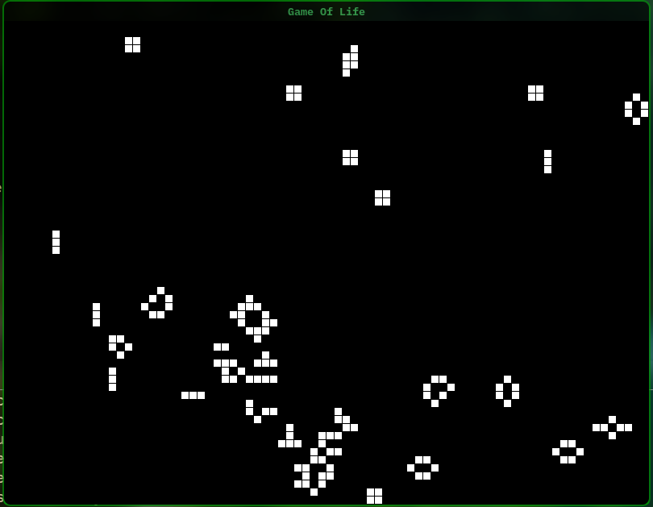

# Conway's Game of Life (C and Raylib)

A simple Conway's Game of Life Simulation made with C and raylib

## What does it do
* **Simulate Conway's Game of Life:** A really simple simulation with simple rules.
* **Game of Life's rules:**
    * Any live cell with fewer than two live neighbours dies, as if by underpopulation.
    * Any live cell with two or three live neighbours lives on to the next generation.
    * Any live cell with more than three live neighbours dies, as if by overpopulation.
    * Any dead cell with exactly three live neighbours becomes a live cell, as if by reproduction.
* **Simple interaction:** Left Click make a on a grid will make it alive.

## Example Output


## How to Build & Run

### 1. Compile
You can compile the source code using `make`:
```bash
make
sudo ./game_of_life
